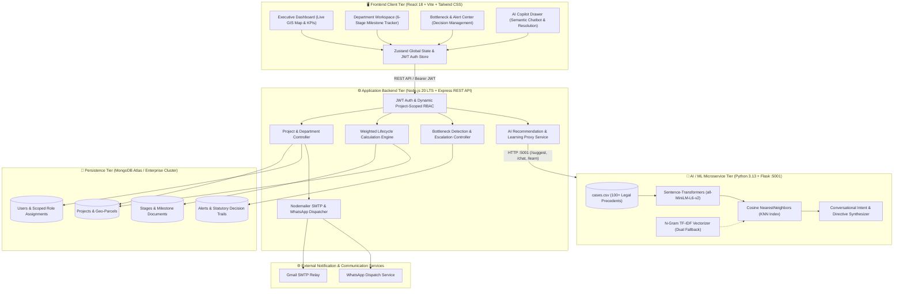
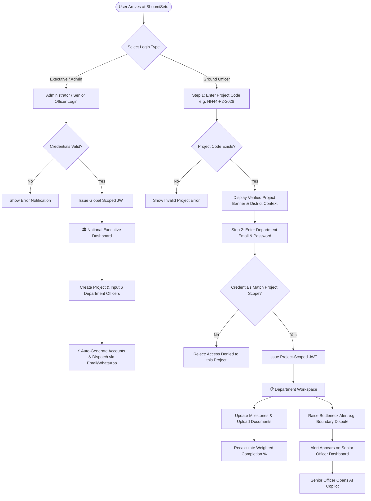
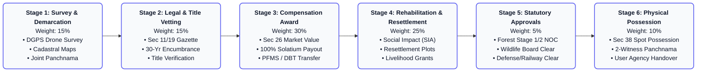
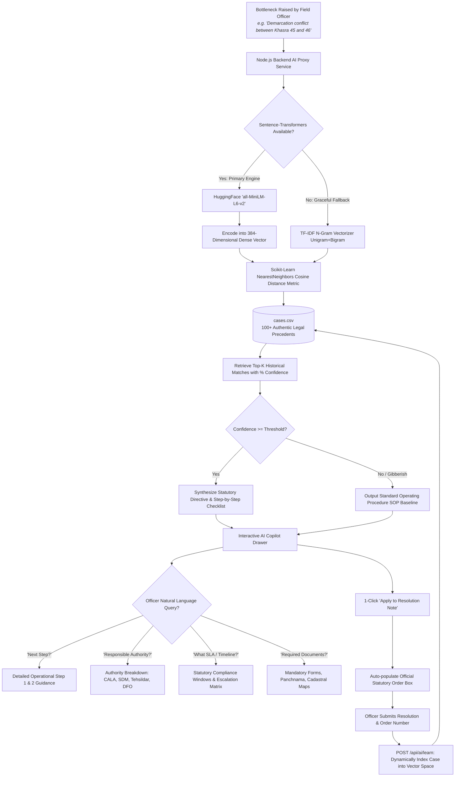

# 🇮🇳 BhoomiSetu — Real-Time National Land Acquisition & Management Platform

<p align="center">
  
  
  
  
  
  
  
  
  
</p>

---

## 📑 Quick Navigation for Team & Reviewers
- [🎯 Executive Summary & Problem Statement](#-executive-summary--the-core-problem)
- [💡 What BhoomiSetu Does (The Solution)](#-what-bhoomisetu-does-the-solution)
- [✨ Key Features & Capabilities](#-key-features--capabilities)
- [👥 Team & Contributors](#-team--contributors)
- [🏗️ System Architecture & Workflow Diagrams](#️-system-architecture--workflow-diagrams)
  - [1. Multi-Tier System Architecture & Data Flow](#1-multi-tier-system-architecture--data-flow)
  - [2. User Journey & 2-Step Project-Scoped RBAC Flow](#2-user-journey--2-step-project-scoped-rbac-flow)
  - [3. 6-Stage Statutory Land Acquisition Lifecycle Pipeline](#3-6-stage-statutory-land-acquisition-lifecycle-pipeline)
  - [4. Neural Semantic Search & AI Resolution Engine](#4-neural-semantic-search--ai-resolution-engine)
- [📁 Folder Structure Explained](#-folder-structure-explained)
- [👥 User Roles & Permissions Matrix](#-user-roles--permissions-matrix)
- [📊 The 6-Stage Statutory Land Acquisition Lifecycle](#-the-6-stage-statutory-land-acquisition-lifecycle)
- [🤖 AI Bottleneck Resolution Copilot](#-ai-bottleneck-resolution-copilot-neural-semantic-search)
- [⚡ Step-by-Step Setup Guide (Run in 5 Minutes)](#-step-by-step-setup-guide-run-in-5-minutes)
- [🔑 Demo Accounts & Credentials](#-demo-accounts--credentials)
- [🧪 Step-by-Step End-to-End Demo Script](#-step-by-step-end-to-end-demo-script)
- [📑 Complete API Reference](#-complete-api-reference)
- [📽️ 6-Slide Hackathon Pitch Deck](#-6-slide-sih-pitch-deck-structure)
- [❓ Frequently Asked Questions (FAQ)](#-frequently-asked-questions-faq)
- [📜 License & Intellectual Property](#-license--intellectual-property)

---

## 🎯 Executive Summary & The Core Problem

Large-scale national infrastructure initiatives (Highways, Dedicated Freight Corridors, Metro Rails, Industrial Parks, Smart Cities) routinely suffer from **massive time delays (averaging 3–5 years) and staggering cost overruns (40%+)** during the land acquisition phase.

### The 4 Major Pain Points in Traditional Governance:
1. **Siloed Departmental Execution**: 6 statutory departments (*Survey, Legal Title Verification, Compensation Disbursement, Rehabilitation & Resettlement, Statutory Clearances, Physical Possession*) operate in isolation using physical files or disjointed local spreadsheets.
2. **Zero Centralized Multi-Tier Telemetry**: State Principal Secretaries and Central Ministries have no live GIS map view or real-time bottleneck alerting.
3. **Repetitive Disputes & Zero Institutional Memory**: Common disputes (boundary overlap, family inheritance disputes, fraudulent Power of Attorney, Aadhaar/PFMS payment mismatches, Forest NOC delays) repeat across every district because past solutions are never codified into a reusable knowledge base.
4. **Credential Onboarding Friction**: Deploying ground officers across dozens of simultaneous national infrastructure projects causes account collisions and administrative overhead.

---

## 💡 What BhoomiSetu Does (The Solution)

**BhoomiSetu** is an end-to-end, real-time, GIS-enabled digital governance platform that unifies all 6 statutory land acquisition departments under a single pane of glass:
- 🗺️ **Live GIS Map & Weighted Telemetry**: Real-time project completion calculation (0% to 100%) weighted by statutory effort.
- 🔐 **2-Step Project-Scoped RBAC**: Eliminates login collisions for ground officers deployed across multiple regional projects.
- 📲 **Automated Multi-Channel Dispatch**: 1-click credential distribution to ground officers via Gmail SMTP & WhatsApp with in-place credential editing.
- 🤖 **AI Bottleneck Copilot & Interactive Chatbot**: High-dimensional neural semantic embeddings (`sentence-transformers / all-MiniLM-L6-v2`, 384 dense vector dimensions) paired with a cosine NearestNeighbors (KNN) engine trained on 100+ authentic legal/administrative precedents. Provides real-time resolution steps, statutory act references, turnaround time estimates, and answers natural follow-up questions with context-aware semantic search.
- 🔄 **Continuous Self-Learning Loop**: Whenever an officer resolves a deadlock, the resolution steps are ingested and embedded by the AI microservice in real time to train future suggestions.

---

## ✨ Key Features & Capabilities

| Capability | Technical Implementation | Impact on Governance |
| :--- | :--- | :--- |
| 🗺️ **GIS Geospatial Command Center** | Leaflet.js interactive vector mapping with GeoJSON parcel demarcations, project pins, and dynamic color codes. | Real-time visual tracking of linear corridors and acquisition boundaries across state districts. |
| 📊 **Weighted 6-Stage Progress Engine** | Milestone aggregation model assigning statutory weights (15% Survey, 15% Legal, 30% Compensation, 25% R&R, 5% Approvals, 10% Possession). | Replaces arbitrary progress percentages with mathematical, audit-ready project completion metrics. |
| 🔐 **2-Step Project-Scoped Auth** | Step 1 project-code verification + Step 2 department credentials with signed JWT claims. | Completely prevents cross-project dossier contamination for officers serving multiple infrastructure projects. |
| 📩 **Multi-Channel Credential Dispatch** | Nodemailer SMTP + automated WhatsApp webhook notification generation with credentials. | Zero onboarding delay; ground officers receive operational accounts instantaneously on project creation. |
| 🧠 **Neural Semantic Precedent Engine** | HuggingFace `all-MiniLM-L6-v2` dense embeddings (384D) + Scikit-Learn `NearestNeighbors(metric='cosine')`. | Matches fuzzy dispute complaints to exact historical precedents regardless of vocabulary variations. |
| 💬 **Conversational Resolution Copilot** | Natural Language intent parsing for Next Steps, SLAs, Legal Authorities, and Mandatory Documents. | Acts as an on-demand statutory legal advisor to tehsildars, SDMs, and Competent Authorities (CALA). |
| 🔄 **Real-Time Self-Learning Loop** | Incremental vector re-indexing on every closed bottleneck via `POST /api/ai/learn`. | Institutional memory expands with every solved dispute across all participating states. |
| 🛡️ **Auditable Decision Trails** | Immutable historical decision records with statutory order numbers and timestamped notes. | 100% legal compliance and transparency for court inquiries and RTI verifications. |

---

## 👥 Team & Contributors

| Name | Role | GitHub Profile |
|---|---|---|
| **Anvesha Singh** | Lead & Frontend & UI/UX Design | — |
| **Keshaw Jha** | AI, Backend & Database Architecture | [@keshaw006](https://github.com/keshaw006) |
| **Aaditya Singh** | Full-Stack & ML Architect | [@Aadityasingh0709](https://github.com/Aadityasingh0709) |
| **Sudhanshu Singh** | QA, Product Research & Database Systems | — |
| **Garima Gupta** | Documentation & Statutory Compliance | — |
| **Vivek Kr. Das** | GIS Data & Evaluation | — |

---

## 🏗️ System Architecture & Workflow Diagrams

### 1. Multi-Tier System Architecture & Data Flow



---

### 2. User Journey & 2-Step Project-Scoped RBAC Flow



---

### 3. 6-Stage Statutory Land Acquisition Lifecycle Pipeline



---

### 4. Neural Semantic Search & AI Resolution Engine



---

## 📁 Folder Structure Explained

```
bhoomisetu-sih26016/
├── backend/                       # 🟢 Node.js & Express REST API Server
│   ├── config/                    # Database (db.js) & Email (mailer.js) setup
│   ├── middleware/                # JWT Auth, Dynamic RBAC, Error handlers
│   ├── models/                    # Mongoose Models: Project, User, Alert, Stage, Department
│   ├── routes/                    # Express Routes: auth, projects, alerts, aiRoutes
│   ├── services/                  # Business Logic: aiRecommendationService, emailService
│   ├── scripts/                   # Database seeder (seed.js) with test projects & users
│   ├── server.js                  # Entry point for backend (Port 5000)
│   └── package.json
│
├── frontend/                      # 🔵 React 18 + Vite Web Application
│   ├── public/                    # Static public assets & logos
│   ├── src/
│   │   ├── api/                   # Axios HTTP client calls (auth.js, projects.js, ai.js)
│   │   ├── components/            # Reusable UI: AppLayout, AIChatDrawer, Navbar, Modal
│   │   ├── features/              # Core Feature Pages:
│   │   │   ├── alerts/            # AlertsPage.jsx (Bottlenecks, Decision & Resolution)
│   │   │   ├── auth/              # LoginPage.jsx (2-Step Login & Executive Auth)
│   │   │   ├── dashboard/         # DashboardPage.jsx (Live GIS Map & High-Level KPIs)
│   │   │   ├── department/        # DepartmentWorkspace.jsx (Officer's 6-Stage Workspace)
│   │   │   └── projects/          # ProjectListPage.jsx, ProjectDetailPage.jsx, CreateProjectModal.jsx
│   │   ├── routes/                # ProtectedRoute.jsx (Role-based access guard)
│   │   ├── store/                 # Zustand global auth and state stores
│   │   ├── App.jsx                # Route declarations
│   │   └── main.jsx               # React entry point (Port 5173)
│   └── package.json
│
├── bhoomisetu-ml-service/         # 🟡 Python Flask ML & Conversational Engine
│   ├── data/                      # cases.csv (100+ authentic Land Acquisition precedents)
│   ├── model/                     # knn_model.pkl (Dense embedding cache + KNN index)
│   ├── app.py                     # Flask App: /chat, /suggest, /learn, /train (Port 5001)
│   ├── run.js                     # Zero-config Node runner with auto Python & dependency detection
│   ├── requirements.txt           # Python dependencies (sentence-transformers, scikit-learn, flask)
│   └── README.md                  # Microservice technical documentation
│
├── package.json                   # Root workspace scripts (npm run dev, npm run install:all)
└── README.md                      # Complete Project Documentation (You are here)
```

---

## 👥 User Roles & Permissions Matrix

BhoomiSetu features **Project-Scoped Role-Based Access Control (RBAC)** to ensure data security and prevent cross-project interference:

| Role | Level | Access Scope | Key Capabilities |
|---|---|---|---|
| **Administrator** | National / Ministry | Global (All Projects) | Create projects, provision/edit officer credentials, trigger re-dispatch, view national telemetry. |
| **Senior Officer** | State / District Magistrate | Global / District | Review active bottlenecks, invoke AI Copilot, issue official directives & statutory orders. |
| **Project Manager** | Project Nodal Officer | Assigned Projects | Track project milestones, coordinate across departments, review stage velocity. |
| **Department Officer** | Field Level (6 Depts) | Single Project & Department | Update assigned stage milestones, upload documents, log completion %, report bottlenecks. |

---

## 📊 The 6-Stage Statutory Land Acquisition Lifecycle

Every project is automatically calculated from **0% to 100% completion** using weighted statutory milestones:

| Stage # | Statutory Department | Statutory Weight | Typical Milestones & Deliverables |
|:---:|---|:---:|---|
| **1** | **Survey & Demarcation** | **15%** | DGPS/Drone survey, Cadastral boundary mapping, Joint verification Panchnama |
| **2** | **Legal & Title Verification** | **15%** | Section 11 & 19 Gazette notifications, Title deed vetting, 30-yr Encumbrance check |
| **3** | **Compensation Determination** | **30%** | Section 26 valuation, Award enquiry, 100% Solatium calculation, PFMS / DBT payout |
| **4** | **Rehabilitation & Resettlement** | **25%** | Social Impact Assessment (SIA), Resettlement colony allotment, Livelihood grants |
| **5** | **Statutory Approvals & NOCs** | **5%** | Stage-1/2 Forest Clearance, Wildlife clearance, Railway/Defense NOCs |
| **6** | **Physical Possession Handover** | **10%** | Section 38 spot possession, Panchnama with 2 witnesses, Handover to user agency |

---

## 🤖 AI Bottleneck Resolution Copilot (Neural Semantic Search)

The AI Copilot is accessible directly from every alert card via the **"AI Chatbot"** button or inside the **"Post Decision"** modal.

### How It Works:
1. **Dense Semantic Embeddings (`sentence-transformers / all-MiniLM-L6-v2`)**: Transforms bottleneck alerts, departmental context, and problem causes into 384-dimensional dense semantic vectors. Unlike lexical keyword matching, neural embeddings capture contextual nuances, statutory abbreviations, and legal terminology (e.g., matching compensation disbursement delays to PFMS DBT settlement failure protocols).
2. **High-Dimensional Cosine KNN Retrieval**: Computes cosine distance against indexed historical precedents using `NearestNeighbors(metric='cosine')` to fetch top-K nearest legal resolutions with exact confidence match scores (e.g., `⚡ 93.3% Semantic Match`).
3. **Dual-Engine Robust Fallback**: If transformer weights are loading or dependencies are minimal, the service automatically falls back to an n-gram TF-IDF vectorizer, ensuring 100% service availability.
4. **Interactive Chat (`POST /chat`)**: Officers can ask follow-up questions in natural language:
   - 📌 *"What is the immediate next step?"* → Breaks down Step 1 vs Step 2 with field guidance.
   - 👤 *"Who is the responsible authority?"* → Returns executing officers (CALA, SDM, Tahsildar, DFO) and oversight bodies.
   - ⏱ *"What is the turnaround time / SLA?"* → Explains statutory compliance windows and escalation timelines.
   - 📄 *"What documents are required?"* → Lists mandatory forms, Panchnama templates, and statutory records.
   - 🔍 *"Explain Step 1"* → In-depth operational field procedure.
5. **1-Click Apply**: Inserts the synthesized directive directly into the official resolution text box.
6. **Continuous Self-Learning (`POST /learn`)**: When a deadlock is marked as resolved with an official order number, the ML service dynamically embeds the new resolution into the vector space in real time.

---

## ⚡ Step-by-Step Setup Guide (Run in 5 Minutes)

### Prerequisites:
- **Node.js**: v18 or v20 LTS installed ([Download](https://nodejs.org/))
- **Python**: v3.10+ installed ([Download](https://python.org/))
- **MongoDB**: Active connection string (MongoDB Atlas or Local MongoDB)

### 1️⃣ Clone the Repository
```bash
git clone https://github.com/Aadityasingh0709/bhoomisetu-sih26016.git
cd bhoomisetu-sih26016
```

### 2️⃣ Install All Dependencies (1 Command)
```bash
npm run install:all
```
*Installs root dependencies (`concurrently`), backend packages (`express`, `mongoose`, `jsonwebtoken`), and frontend packages (`react`, `vite`, `tailwindcss`, `lucide-react`).*

### 3️⃣ Configure Environment Variables
Create a `.env` file in the `backend/` directory:
```env
PORT=5000
MONGO_URI=mongodb://127.0.0.1:27017/bhoomisetu
JWT_SECRET=bhoomisetu_super_secret_jwt_key_2026
ML_SERVICE_URL=http://localhost:5001
FRONTEND_URL=http://localhost:5173
```

### 4️⃣ Seed Test Data
Populate the database with pre-configured infrastructure projects (NH-44, Freight Corridor), 6 statutory departments, and demo officer accounts:
```bash
npm run seed
```

### 5️⃣ Launch the Entire Platform (1 Command)
```bash
npm run dev
```
*`npm run dev` automatically runs:*
- 🟢 **Backend API** at `http://localhost:5000`
- 🔵 **Frontend Web App** at `http://localhost:5173`
- 🟡 **ML Semantic Microservice** at `http://localhost:5001` *(via `run.js` with automatic Python detection, virtual environment resolution, and sentence-transformers verification)*

---

## 🔑 Demo Accounts & Credentials

| Role | Email | Password | Access Scope |
|---|---|---|---|
| **Administrator** | `admin@landacquisition.gov.in` | `Admin@2026Secure!` | Global National Dashboard, Project Creation & Credential Dispatch |
| **Senior Officer** | `senior@landacquisition.gov.in` | `Senior@2026Officer!` | State/District Escalations, AI Chatbot Directives, Statutory Approval |
| **Project Officer (Survey)** | `survey@landacquisition.gov.in` | `Survey@2026Land!` | Project Code: `NH44-P2-2026` (Milestone progress & Panchnama uploads) |
| **Project Officer (Legal)** | `legal@landacquisition.gov.in` | `Legal@2026Land!` | Project Code: `NH44-P2-2026` (Section 11/19 Gazette notifications) |
| **Project Officer (Compensation)** | `compensation@landacquisition.gov.in` | `Comp@2026Land!` | Project Code: `NH44-P2-2026` (Section 26 Awards & PFMS disbursements) |
| **Project Officer (R&R)** | `rehab@landacquisition.gov.in` | `Rehab@2026Land!` | Project Code: `NH44-P2-2026` (SIA entitlements & resettlement allotments) |
| **Project Officer (Approvals)** | `approvals@landacquisition.gov.in` | `Appr@2026Land!` | Project Code: `NH44-P2-2026` (Forest Stage 1/2 NOC tracking) |
| **Project Officer (Possession)** | `possession@landacquisition.gov.in` | `Poss@2026Land!` | Project Code: `NH44-P2-2026` (Section 38 Physical Possession Panchnama) |

---

## 🧪 Step-by-Step End-to-End Demo Script

When presenting or testing the platform, follow this exact 5-minute flow:

### Phase 1: Executive Overview & GIS Map
1. Log in as **Administrator** (`admin@landacquisition.gov.in` / `Admin@2026Secure!`).
2. Show the **Executive Dashboard**:
   - Interactive GIS Map with clickable project markers and geo-polygons.
   - High-level KPIs: Total Projects, Land Acquired, Active Bottlenecks, Average Turnaround.

### Phase 2: 1-Click Project & Credential Creation
1. Go to **Projects** → Click **"Create Project"**.
2. Enter project details (e.g. `Delhi-Mumbai Expressway Spur`, District, Land Area).
3. Fill in the 6 departmental officer emails/phones → Click **"Create & Dispatch"**.
4. Show how all 6 accounts are automatically generated and dispatched via Email/WhatsApp!
5. Demonstrate **In-Place Credential Editing** on the Project Dossier to fix any typos without recreating the project.

### Phase 3: Field Officer Execution (2-Step Login)
1. Sign out and click **"Project Officer Login"**.
2. Step 1: Enter Project Code `NH44-P2-2026` → Verified Project banner appears!
3. Step 2: Enter `survey@landacquisition.gov.in` / `Survey@2026Land!`.
4. Navigate to **Department Workspace** → Update milestone progress and upload survey documents.

### Phase 4: Bottleneck Reporting & AI Copilot Chat
1. In **Alerts**, report a new bottleneck:
   - Department: `Survey`
   - Issue Type: `Boundary Dispute`
   - Description: `Survey boundary overlap between Khasra 45 and 46 causing demarcation conflict with adjoining landholders`
2. Sign in as **Senior Officer** (`senior@landacquisition.gov.in` / `Senior@2026Officer!`).
3. Click **"AI Chatbot"** on the alert:
   - See the matched precedent `#LA_001` with **⚡ 93.3% Semantic Match** and statutory reference.
   - Click the chip: *"What should be our next step?"* → AI returns immediate Step 1 & Step 2 roadmap.
   - Click *"What documents are required?"* → AI returns mandatory Panchnama and cadastral sheets.
4. Click **"Apply to Resolution"** → Directive auto-populates into the order box!

### Phase 5: Continuous Self-Learning
1. Complete the resolution and submit the official order number.
2. The Python microservice automatically ingests the resolution via `/api/ai/learn` and embeds it into the vector space in real time!

---

## 📑 Complete API Reference

### 🔐 Authentication & Access APIs
| Method | Endpoint | Description | Auth Required |
|---|---|---|:---:|
| `POST` | `/api/auth/login` | Executive & direct user sign-in | No |
| `POST` | `/api/auth/validate-project` | Validates Project Code for 2-step officer sign-in | No |
| `GET` | `/api/auth/me` | Fetch authenticated user profile & permissions | Yes (JWT) |

### 📁 Project Management APIs
| Method | Endpoint | Description | Auth Required |
|---|---|---|:---:|
| `GET` | `/api/projects` | List all projects with search, filter, and pagination | Yes (JWT) |
| `POST` | `/api/projects` | Create project & auto-provision 6 officer credentials | Admin |
| `GET` | `/api/projects/:id` | Get detailed project dossier, stages & GIS data | Yes (JWT) |
| `PATCH` | `/api/projects/:id/departments/:deptId/officer` | Edit officer credentials with optional instant re-dispatch | Admin |
| `PATCH` | `/api/projects/:id/stages/:stageId` | Update stage milestones, progress % and documents | Officer/Admin |

### 🤖 AI Copilot & Bottleneck APIs
| Method | Endpoint | Description | Auth Required |
|---|---|---|:---:|
| `POST` | `/api/ai/suggest` | Query KNN model for similar cases & resolution templates | Yes (JWT) |
| `POST` | `/api/ai/chat` | Conversational follow-up assistant for next steps, SLA, docs | Yes (JWT) |
| `POST` | `/api/ai/learn` | Ingest a resolved case and trigger incremental retraining | Yes (JWT) |
| `GET` | `/api/ai/stats` | Retrieve total trained precedents and vocabulary stats | Yes (JWT) |
| `GET` | `/api/alerts` | Fetch active and resolved bottlenecks across projects | Yes (JWT) |
| `POST` | `/api/alerts` | Raise a new bottleneck or cross-department delay | Yes (JWT) |
| `POST` | `/api/alerts/:id/decision` | Post senior authority directive/order | Senior Officer |
| `POST` | `/api/alerts/:id/resolve` | Final closure with auditable resolution order number | Officer/Senior |

---

## 📽️ 6-Slide SIH Pitch Deck Structure

Use this exact structure for presenting to the evaluation panel and jury:

```
┌────────────────────────────────────────────────────────────────────────────────────────┐
│                   BHOOMISETU — 6-SLIDE OFFICIAL SIH PITCH DECK                         │
├─────────┬──────────────────────────────────────────────────────────────────────────────┤
│ Slide 1 │ TITLE & PROBLEM STATEMENT                                                    │
│         │ • Title: BhoomiSetu — Real-Time Land Acquisition Governance Platform         │
│         │ • Ministry: Rural Development — Department of Land Resources (PS-26016)      │
│         │ • Core Problem: 40%+ infra delays, siloed departments, paper-based reporting.│
├─────────┼──────────────────────────────────────────────────────────────────────────────┤
│ Slide 2 │ THE BHOOMISETU SOLUTION                                                      │
│         │ • Unified 6-Stage Digital Lifecycle with Weighted Progress Telemetry (0-100%).│
│         │ • 2-Step Project-Scoped RBAC preventing cross-project login collisions.      │
│         │ • 1-Click Credential Dispatch via Gmail SMTP & WhatsApp.                     │
├─────────┼──────────────────────────────────────────────────────────────────────────────┤
│ Slide 3 │ SYSTEM ARCHITECTURE & GIS TELEMETRY                                          │
│         │ • Frontend: React 18, Vite, Tailwind, Leaflet GIS Geo-Parcels.               │
│         │ • Backend: Node.js 20 LTS, Express REST API, MongoDB Atlas.                  │
│         │ • ML Service: Python 3.13 Flask, Sentence-Transformers (all-MiniLM-L6-v2) +KNN│
├─────────┼──────────────────────────────────────────────────────────────────────────────┤
│ Slide 4 │ AI BOTTLENECK RESOLUTION COPILOT                                             │
│         │ • Precedent Engine: 384D Dense Vector Embeddings + 100+ Precedent Cases.     │
│         │ • Conversational Chatbot: Answers Next Steps, Responsible Authority, SLAs.   │
│         │ • Continuous Self-Learning: Dynamically updates model on every resolved alert│
├─────────┼──────────────────────────────────────────────────────────────────────────────┤
│ Slide 5 │ ADMINISTRATIVE RESILIENCE & OFFICER EMPOWERMENT                              │
│         │ • 1-Click Multi-Officer Provisioning per project.                            │
│         │ • In-Place Officer Credential Editing (fix typos without deleting projects). │
│         │ • Real-Time SLA monitors, cross-stage dependency tracking & dispute trails.  │
├─────────┼──────────────────────────────────────────────────────────────────────────────┤
│ Slide 6 │ NATIONAL IMPACT & FEASIBILITY                                                │
│         │ • 40% reduction in land acquisition Turnaround Time (TAT).                   │
│         │ • 100% auditable digital paper trail for every legal order & award.          │
│         │ • Future Scope: Drone LIDAR integration, DigiLocker & Blockchain Registry.   │
└─────────┴──────────────────────────────────────────────────────────────────────────────┘
```

---

## ❓ Frequently Asked Questions (FAQ)

<details>
<summary><b>Q1: Why does BhoomiSetu use 2-Step Authentication for field officers?</b></summary>
Ground officers (e.g. Tehsildars, Surveyors) often work on multiple infrastructure projects simultaneously (e.g. NH-44 and Eastern Freight Corridor). If they had a single generic login, their actions would cross-contaminate different project dossiers. The 2-Step login binds their session strictly to the selected project code.
</details>

<details>
<summary><b>Q2: What happens if the AI does not find a matching historical precedent?</b></summary>
BhoomiSetu contains strict semantic validation. If an unrecognizable problem or typo is entered, the AI will not hallucinate. Instead, it flags a <code>0% Match</code>, generates a Standard Operating Procedure (SOP) baseline, and offers 1-click recognized precedent presets.
</details>

<details>
<summary><b>Q3: How does the AI self-learning loop work?</b></summary>
When an alert is marked as resolved by an officer or magistrate, the backend calls <code>POST /api/ai/learn</code> on the Python microservice. The microservice appends the new resolution to <code>cases.csv</code> and dynamically encodes the new resolution into the high-dimensional vector space in less than 1 second.
</details>

<details>
<summary><b>Q4: Why does BhoomiSetu use Sentence-Transformers (all-MiniLM-L6-v2) for Semantic Embeddings?</b></summary>
Traditional lexical matching algorithms (like simple keywords or TF-IDF alone) fail when field officers use varying phrases for the same root cause (e.g. "PFMS DBT disbursement failure" vs "compensation bank transaction returned"). The 384-dimensional dense semantic embeddings capture conceptual statutory meaning and contextual relationships, ensuring accurate precedent matching regardless of phrasing, with automatic fallback to TF-IDF for zero downtime.
</details>

---

## 📜 License & Intellectual Property

Developed for **Smart India Hackathon 2026** under the aegis of the **Ministry of Rural Development — Department of Land Resources (DoLR)**. All rights reserved for public sector governance modernization.
